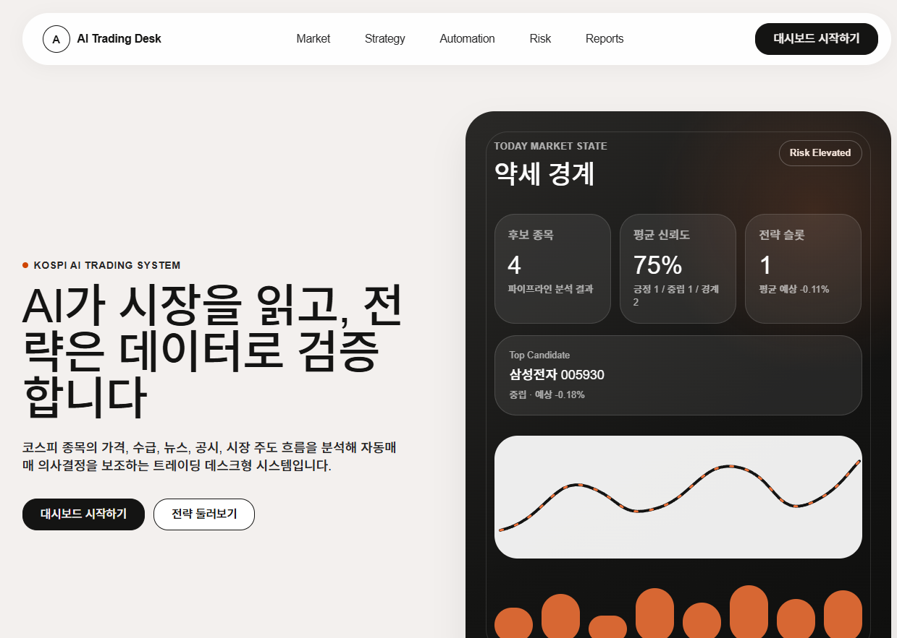
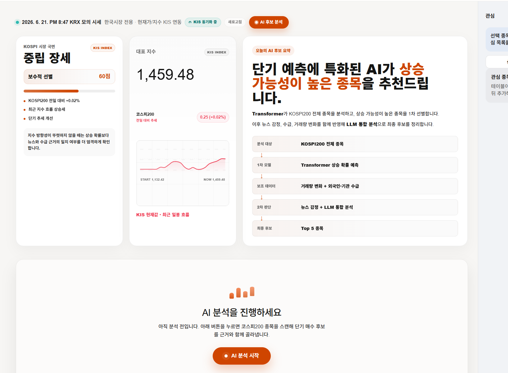
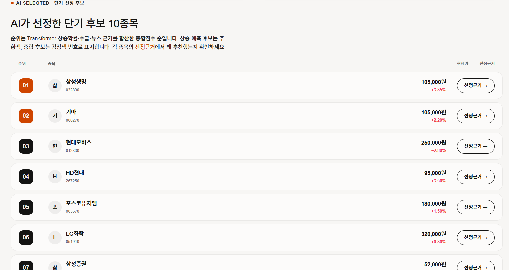
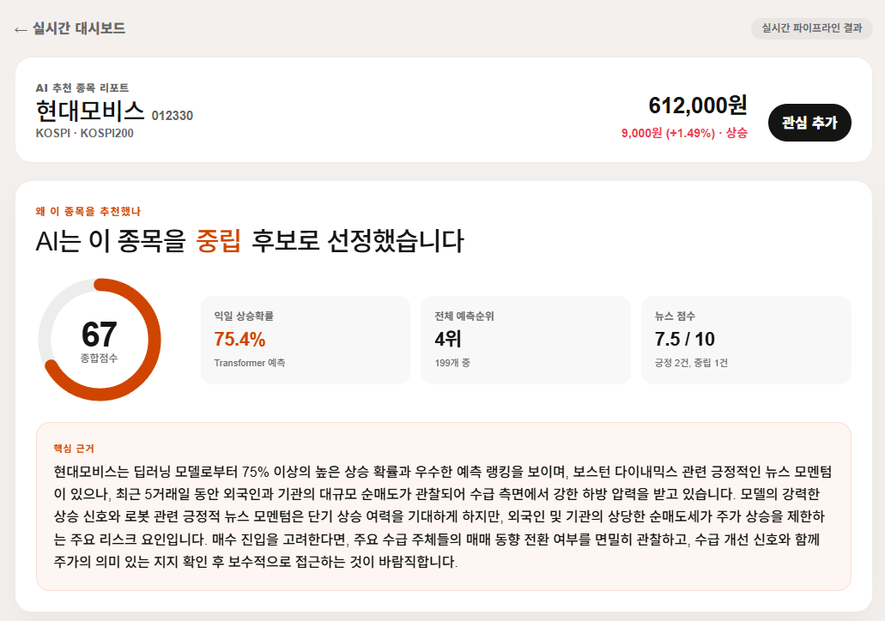
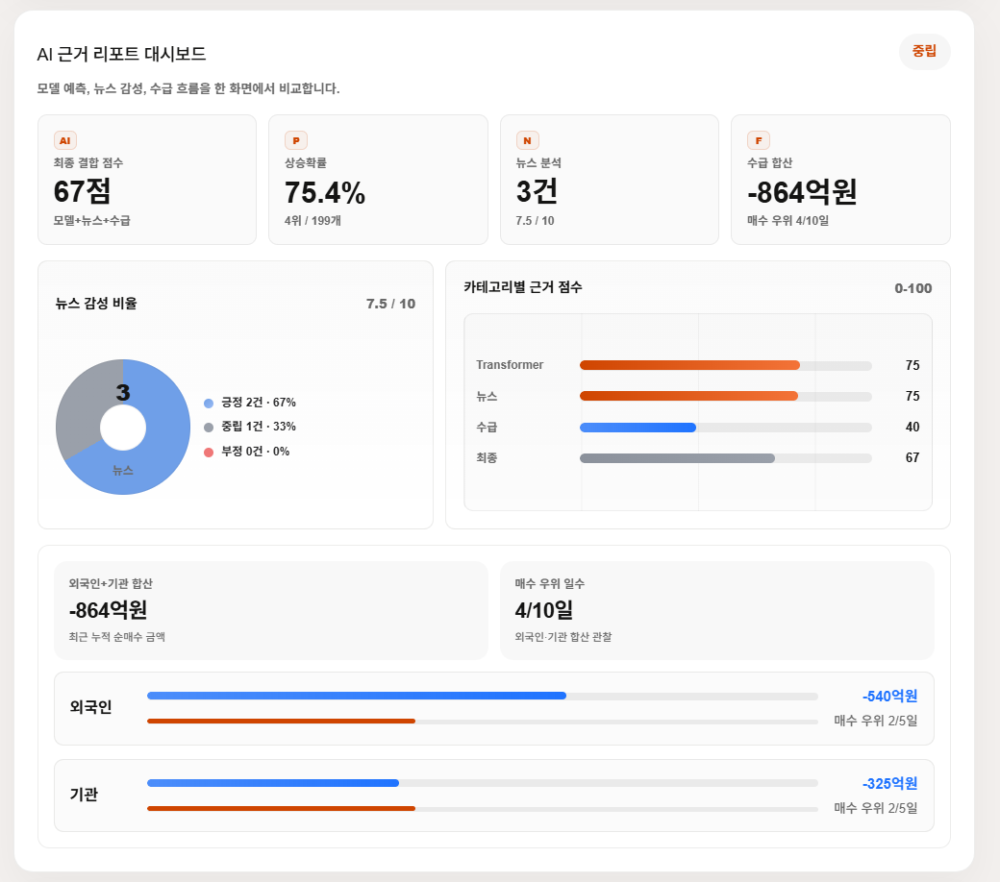
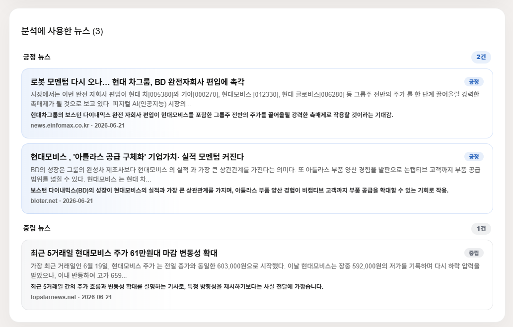
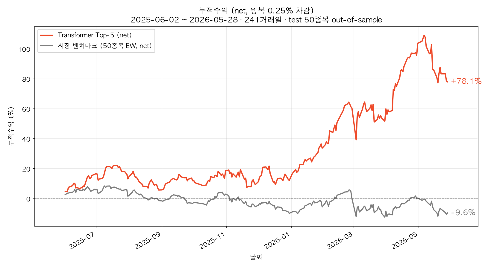
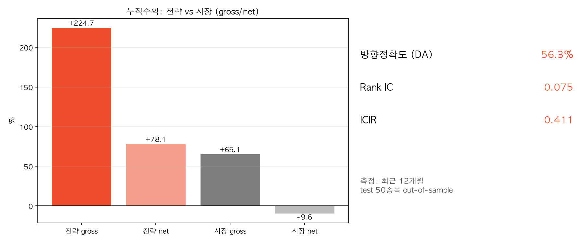
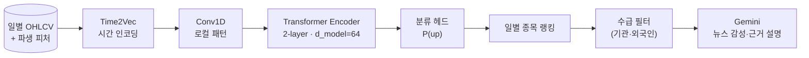

<div align="center">

# 📈 KOSPI AI Trading Desk

### 트랜스포머로 KOSPI200 익일 상승확률을 랭킹하고, LLM이 뉴스 근거를 설명하는 주가 예측 파이프라인

[](https://pytorch.org/)
[](https://www.python.org/)
[](https://pandas.pydata.org/)
[](https://react.dev/)
[](https://vitejs.dev/)
[](https://ai.google.dev/)

**동아대학교 컴퓨터공학과 졸업작품 (4인 팀, 2026)**

> 🙋 **본인(강승주) 담당** — Transformer/LSTM 정량 모델 설계·학습·비교, 백테스트 파이프라인, 종목 기준 out-of-sample 검증 체계
> (원본 팀 저장소: [hadesee/deep-learning-stock-trading](https://github.com/hadesee/deep-learning-stock-trading))

</div>

---

## 한눈에

KOSPI200 종목의 **익일 상승확률 P(up)** 을 트랜스포머로 추정해 매일 랭킹하고 → 수급 필터를 거쳐 → **LLM이 뉴스 감성 기반 근거를 설명**하는 3단계 파이프라인입니다.
핵심은 예측 성능 자체보다 **"이 숫자를 믿어도 되는가"를 검증하는 설계**입니다: 학습에 한 번도 쓰지 않은 50개 종목으로만 성능을 측정합니다.

```
STEP 1. 정량 모델         →  STEP 2. 수급 필터    →  STEP 3. LLM 근거 설명
Transformer P(up) 랭킹        기관·외국인 수급         뉴스 감성분석 (Gemini)
```

## 🖥️ 웹 대시보드

파이프라인 결과를 트레이딩 데스크 형태로 시각화합니다. Transformer 상승확률·수급·뉴스 근거를 종목별로 한 화면에서 비교하고, 각 추천의 **선정 근거**를 LLM 설명과 함께 확인할 수 있습니다. (React + Vite, KIS 모의 시세 연동, Vercel 배포)

<div align="center">



| 실시간 대시보드 · 시장 국면 | AI 선정 단기 후보 |
| :---: | :---: |
|  |  |
| **시장 국면 · AI 후보 분석 파이프라인** | **종합점수 랭킹 (모델+뉴스+수급)** |

| 종목 근거 리포트 | AI 근거 대시보드 |
| :---: | :---: |
|  |  |
| **종합점수 · 익일 상승확률 · 핵심 근거** | **모델 · 뉴스 감성 · 수급 종합 비교** |



**분석에 사용한 뉴스 — LLM이 근거로 삼은 기사(긍정/중립/부정)**

</div>

> 각 종목 카드는 **종합점수 = 모델(Transformer P(up)) + 뉴스 감성 + 수급** 을 결합해 산출하며, 상승 예측·중립 후보를 구분해 보여줍니다. 수급이 나쁘면(외국인·기관 순매도) 상승 신호가 있어도 보수적으로 낮춰 표기합니다.

## 📊 핵심 결과 — 최근 12개월 out-of-sample

**측정 조건: 2025.06.02 ~ 2026.05.28 (241거래일) · 학습에 미사용한 test 50종목 · Top-5 동일가중 · 일별 리밸런싱 · 왕복 거래비용 0.25% 반영**

<div align="center">



</div>

| 지표 | 값 | 의미 |
| --- | :---: | --- |
| 방향 예측 정확도 (DA) | **56.3%** | P(up)>0.5 기준 익일 방향 적중률 (n=12,050) |
| Rank IC / ICIR | **0.075 / 0.411** | 일별 P(up)–익일수익 스피어만 상관 평균 / 그 안정성 |
| 전략 누적수익 (net) | **+78.1%** | Top-5 전략, 비용 차감 후 (gross +224.7%) |
| 시장 벤치마크 (net) | **−9.6%** | 동일 50종목 EW·일별 리밸런싱·동일 비용 — 전략과 완전히 같은 조건에서 종목 선택만 무력화한 기준선 (gross +65.1%) |

<div align="center">



</div>

> ⚠️ **벤치마크 읽는 법** — 위 −9.6%는 "종목 선택 능력"을 분리 측정하기 위해 매매 조건을 전략과 동일하게 통제한 기준선입니다(KOSPI200 지수가 아님). 같은 50종목을 **buy & hold** 하면 **+85.0%** 로, 일별 리밸런싱 전략의 거래비용 부담은 [한계](#-한계-정직하게)에 명시했습니다.
>
> 📈 위 차트는 `python verify_results.py --plot` 로 그대로 재생성됩니다.

## 🧪 검증 설계 — 이 프로젝트의 진짜 기여

**① 종목 기준 데이터 분리 (누수 차단)**

시간 분할만으로는 같은 종목의 패턴이 train/test에 걸쳐 새어 들어갑니다. 그래서 **종목 자체를 분리**했습니다:

| 구분 | 종목 수 | 용도 |
| --- | :---: | --- |
| Train | 120 | 학습 |
| Validation | 30 | 하이퍼파라미터·조기종료 |
| **Test** | **50** | **성능 측정 전용 — 학습·튜닝에 일절 미사용** |

위 핵심 결과의 모든 수치는 test 50종목에서만 측정된 값입니다.

**② 정렬·손실 버그를 수치로 잡음** — 개발 과정에서 NaN loss, 방향 페널티의 기울기 소실, 라벨 1일 어긋남(look-ahead) 등을 발견·수정했습니다. "좋아 보이는 숫자"가 나올 때마다 원인을 역추적하는 것을 원칙으로 했습니다.

**③ 분류 vs 회귀 비교** — 동일 조건에서 분류(상승확률)와 회귀(수익률) 헤드를 비교해 분류 채택.

## 🏗️ 모델 아키텍처



경량 encoder-only 구성(2-layer, d_model=64)을 택한 이유: 일별 금융 시계열은 노이즈 대비 신호가 약해, 용량을 키울수록 노이즈 암기(과적합) 위험이 커집니다.

- **입력 피처(11종)** — 로그수익률(O/H/L/C), 거래량 z-score(인과적), RSI, MACD/Signal, 볼린저 %B·정규화 밴드폭. 모두 누수 없이 계산.
- **체크포인트** — `transformer_5y.pt` (2021-06~ 5년치로 학습된 분류 모델).

## ⚠️ 한계 (정직하게)

- **거래비용 vs buy & hold** — 일별 리밸런싱은 비용에 취약합니다. 같은 test 50종목 buy & hold(+85.0%) 대비 net 수익이 낮으며, 실전화하려면 리밸런싱 주기 완화가 선행돼야 합니다.
- **구간 의존성** — 위 헤드라인은 최근 12개월 구간 값입니다. 2017~2026 9년 전체로 확장하면 DA 53.5%, 일별 리밸런싱 net은 비용 누적으로 크게 하락합니다.
- **소표본 주의** — 241거래일·50종목은 통계적으로 넉넉한 표본이 아니며, ICIR 0.411은 "안정적 경향" 이상을 주장하지 않습니다.
- **수급 데이터의 30일 제한** — KIS `inquire-investor` 는 최근 ~30거래일만 제공하므로 장기 백테스트에는 쓸 수 없어, 헤드라인 수치는 **트랜스포머 단독** 평가입니다.
- **모의투자(VTS) 환경** — KIS 모의투자 엔드포인트를 사용합니다. 실거래와 체결·가격이 다를 수 있습니다.
- **투자 조언 아님** — 본 저장소는 학술 목적의 졸업작품이며 어떠한 투자 판단의 근거도 될 수 없습니다.

## 🔁 재현

핵심 수치는 저장 결과 파일이 아니라 **모델 재실행으로 결정론적으로 재현**됩니다 (재학습·난수 없음):

```bash
pip install -r requirements.txt
python verify_results.py      # shared_test_raw.parquet + transformer_5y.pt → 핵심 결과 표 재현
```

실행하면 DA / Rank IC / ICIR / 전략·시장 누적수익을 출력하고 README 기재값과 대조합니다. 구간·비용은 인자로 조정할 수 있습니다:

```bash
python verify_results.py --start 2025-06-01 --end 2026-05-28 --topk 5 --cost 0.25
```

> train/validation 원본 데이터(120+30종목)는 용량 문제로 미포함이며, 성능 측정에 필요한 test 50종목(`shared_test_raw.parquet`)과 학습 완료 체크포인트(`transformer_5y.pt`)만 커밋되어 있습니다.

### 전체 파이프라인 실행 (선택)

STEP 1~3(후보 수집 → 랭킹 → LLM 근거)까지 돌리려면 KIS·Naver·LLM API 키가 필요합니다.

```bash
cp .env.example .env          # APP_KEY/APP_SECRET(KIS), NAVER_*, GEMINI_API_KEY 등
python integrated_pipeline.py            # STEP 1~2 (수급 필터 포함)
python integrated_pipeline.py --run-news # + STEP 3 (뉴스·LLM 근거)
```

## 🗂️ 프로젝트 구조

```text
.
├─ verify_results.py         # ★ 핵심 결과 재현/검증 (test 50종목, self-contained)
├─ integrated_pipeline.py    # STEP1~2 파이프라인 진입점 (선택적 STEP3)
├─ model.py / data.py        # StockTransformer 정의 · 누수 차단 피처 계산
├─ predict.py                # 체크포인트 추론
├─ transformer_5y.pt         # 학습된 Transformer 체크포인트
├─ shared_test_raw.parquet   # test 50종목 원시 OHLCV (재현용)
├─ stock_news_llm_sentiment.py  # (STEP3) 뉴스 수집 + LLM 근거
└─ FE/                       # 웹 대시보드 (React + Vite + TypeScript, Vercel)
```

## 🛠️ 기술 스택

- **모델** — PyTorch (Transformer encoder, Time2Vec, Conv1D), LSTM 비교군
- **데이터** — pandas, pykrx, 한국투자증권(KIS) API
- **LLM 파이프라인** — Gemini API (뉴스 감성·근거 설명), Naver 뉴스 API
- **웹 대시보드** — React, Vite, TypeScript, React Router · Vercel 서버리스 함수로 KIS 시세/파이프라인 연동
- **검증** — 종목 기준 split, out-of-sample 백테스트, 비용 모형(왕복 0.25%)

## 👥 팀

동아대학교 컴퓨터공학과 졸업작품 4인 팀. 본 포크는 팀원 [강승주(dan6396)](https://github.com/dan6396)의 담당 파트(정량 모델·백테스트·검증)를 중심으로 문서화한 버전입니다.

---

> **면책** — 본 코드와 결과는 학술·교육 목적이며 **투자 조언이 아닙니다.** 어떤 금융 손익에 대해서도 책임지지 않습니다. KIS·Naver·Google 각 서비스의 이용약관을 준수하세요.
