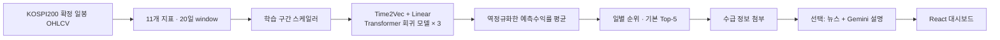
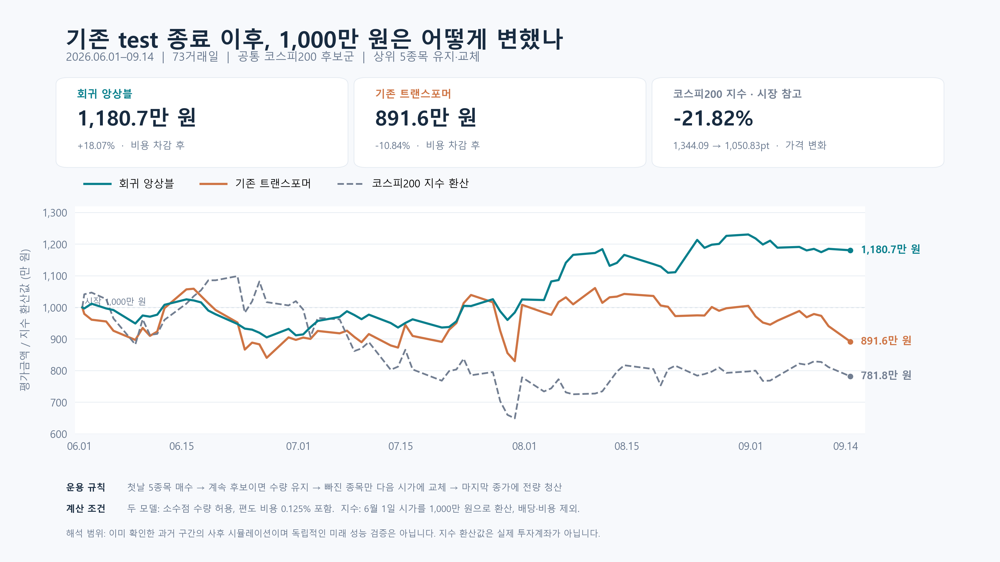

# KOSPI AI Trading Desk

KOSPI200 종목의 **다음 거래일 시가→종가 수익률**을 예측하고, 순위에 수급·뉴스 정보를 붙여 보여주는 졸업작품입니다. 기본 모델은 **Conv를 제거한 Time2Vec Transformer 3개의 Huber 회귀 앙상블**입니다.

동아대학교 컴퓨터공학과 4인 팀 프로젝트이며, 이 저장소는 강승주 담당 파트인 정량 모델·백테스트·검증을 중심으로 정리한 포크입니다. 실제 주문을 실행하는 투자 서비스가 아닌 연구용 프로젝트입니다.

## 화면

| 대시보드 | 후보 랭킹 |
|---|---|
|  |  |

위 화면은 기존 분류 모델 버전의 디자인 참고 이미지입니다. 현재 코드는 회귀 **예측수익률**을 표시하며, 기존 화면의 상승확률 수치를 새 모델 결과로 사용하지 않습니다.

## 모델 교체 내용

| 항목 | 기존 모델 | 현재 기본 모델 |
|---|---|---|
| 입력 | 20거래일 × 11개 지표 | 동일한 20 × 11개 지표 |
| 입력 투영 | Time2Vec + 시간축 Conv1D | Time2Vec + 일자별 Linear |
| 예측기 | Transformer 1개 | Transformer 3개, seed 42·43·44 |
| 목적 | 익일 종가 방향 분류 | 다음 거래일 시가→종가 수익률 회귀 |
| 손실 | 분류 손실 | 학습 수익률 표준화 후 Huber 손실 |
| 출력 | 상승확률 P(up) | 각 모델 출력 역정규화 후 수익률의 산술평균 |
| 순위 | 상승확률 내림차순 | 예측수익률 내림차순, 동점이면 종목코드 순 |

`0.012`는 **예측수익률 +1.2%**입니다. 상승확률 1.2%가 아니며 sigmoid나 0.5 임계값을 적용하지 않습니다. 앙상블은 같은 구조를 서로 다른 seed로 학습한 세 모델입니다.

Conv 없는 구조로 이미 재학습하고 비교한 **확정 가중치**를 옮겼습니다. 이번 교체 과정에서 추가 학습이나 튜닝은 하지 않았습니다. 체크포인트와 스케일러 출처·SHA-256은 [모델 manifest](models/huber_ensemble/manifest.json)에 있습니다.

## 빠른 실행 — API 키 없이 확인

Python 3.10 이상이 필요합니다. 이번 검증 환경은 Python 3.13, PyTorch 2.12 CPU, NumPy 2.4.6, pandas 2.3.3, PyArrow 24.0입니다. 의존성 파일의 모든 버전 조합을 검사한 것은 아닙니다.

```bash
pip install -r requirements-inference.txt
python verify_ensemble.py
python predict.py --data tests/fixtures/ensemble/raw_ohlcv.parquet --ticker 005930 --as-of 2026-09-11
```

기본 경로는 `models/huber_ensemble/manifest.json`입니다. 모델 3개와 스케일러가 포함되어 별도 다운로드나 재학습이 필요 없습니다. `--as-of`는 입력의 마지막 날짜를 제한합니다. 제공 자료는 과거 재현용이며 최신 시세가 아닙니다.

```python
from ensemble import DEFAULT_MANIFEST
from predict import predict_multiple

# 각 DataFrame: 단일 종목, 일별 DatetimeIndex, Open/High/Low/Close/Volume
# 반드시 장이 끝난 날짜까지만 입력하며 충분한 과거 이력을 함께 제공
scores, errors = predict_multiple(
    str(DEFAULT_MANIFEST), ticker_dfs, return_errors=True,
)
# scores: 예측수익률 내림차순. 실패 종목은 NaN, 원인은 errors에 기록.
```

입력 지표는 과거 데이터만으로 계산하며 학습 당시 스케일러를 그대로 적용합니다. 지표 준비 구간을 위해 60행 이상을 권장하고, 지수이동평균 초기값 영향을 줄이려면 가능한 긴 이력을 제공합니다. 추론 중 정규화 값을 새로 학습하지 않습니다.

## 아키텍처



수급은 후보에 참고 정보를 붙입니다. 아래 수익률 검증에는 수급 필터나 뉴스 점수에 따른 재선정을 적용하지 않았습니다. 뉴스가 반영된 대시보드 종합점수와 순수 모델의 `pred_rank`는 구분해야 합니다.

## 1,000만 원 비교 결과

기존 test 마지막 거래일 **2026-05-29 이후**, **2026-06-01~2026-09-14의 73거래일**을 비교했습니다. 같은 일별 199~200개 후보, 같은 가격과 거래 규칙을 적용했습니다.



| 지표 | 기존 분류 Transformer | 채택한 회귀 앙상블 |
|---|---:|---:|
| 시작 자산 | 10,000,000원 | 10,000,000원 |
| 최종 자산 | 8,916,409원 | **11,807,394원** |
| 순손익 | −1,083,591원 | **+1,807,394원** |
| 비용 차감 후 수익률 | −10.84% | **+18.07%** |
| 최대 낙폭(MDD) | 21.62% | **11.72%** |
| 누적 거래비용 | 1,353,100원 | 424,781원 |
| 매수 / 매도 건수 | 280 / 280 | 80 / 80 |

매매 규칙:

1. 전 거래일 종가까지의 데이터로 다음 거래일 후보 5개를 선정합니다.
2. 첫날 시가에 5개를 모두 매수합니다.
3. 다음 후보에도 남은 종목은 **기존 수량 그대로 보유**합니다. 제외된 종목만 다음 시가에 팔고, 현금을 신규 후보에 균등 배분합니다.
4. 매수·매도 각각 거래대금의 **0.125%**를 차감하고 마지막 날 종가에 전량 청산합니다.

첫 5종목을 모두 살 수 있도록 **소수점 주식을 허용한 이론적 시뮬레이션**입니다. 정수 주식 주문·시장가 체결을 보장하는 실거래 결과가 아닙니다. 보유를 유지하므로 야간 가격 변동도 손익에 포함되지만, 모델의 학습 목표는 하루의 시가→종가 수익률입니다.

KOSPI200 가격지수는 첫날 시가 1,344.09에서 마지막 날 종가 1,050.83으로 **−21.82%**였습니다. 시장 선은 같은 시작금액으로 환산한 가격지수이며, 배당·거래비용·ETF 추적 오차를 반영한 투자 수익률은 아닙니다.

`python verify_ensemble.py`는 14,583개 고정 입력에서 새 코드로 추론하고 73일 Top-5 순위와 두 포트폴리오 원장을 재검산합니다. 이동 검증에서 예측수익률 최대 절대 오차는 `8.89e-9`, Top-5 순위는 전부 일치했습니다. [검증 기록](docs/validation/README.md)을 참고하세요.

## 학습 구간과 해석의 한계

| 용도 | 기간 |
|---|---|
| 학습 | 2023-03-01~2026-02-27 |
| 검증·체크포인트 선택 | 2026-03-02~2026-05-29 |
| 위 모의투자 평가 | 2026-06-01~2026-09-14 |

학습·검증은 시간으로 분리했고 구간 끝을 넘어가는 수익률 라벨을 제외했습니다. 다만 **평가 결과를 이미 보고 모델과 보유 규칙을 채택했으므로, 위 결과는 독립적인 최종 test나 미래 실전 성과가 아닙니다.** 이 기간에서 앙상블이 나았다는 근거이며 다른 시장·기간의 우월성을 보장하지 않습니다. 과거 구성종목의 완전한 시점별 복원이 아니어서 생존편향 가능성이 있고, 조정주가·이상적인 체결·고정 거래비용을 가정합니다.

기존 README의 방향정확도 56.26%·수익률 +78.11%는 **이전 분류 모델의 다른 기간·종목·매매 가정**에 대한 기록입니다. 종목별 분리만으로 미래 검증이 되지는 않으므로 현재 성능과 나란히 비교하지 않습니다. 이전 계산은 `python verify_results.py`에 남겨 두었습니다.

## 후보 분석과 화면 실행

```bash
pip install -r requirements.txt
# .env에 KIS 자격증명 설정
python integrated_pipeline.py
# 뉴스·Gemini 분석까지 실행하려면 해당 API 키 설정 후:
python integrated_pipeline.py --run-news

cd FE
npm ci
npm run dev
```

기본 Top-5이며 `--final-max 10`으로 화면 후보 수를 바꿀 수 있습니다. 별도 전략 설정이므로 위 Top-5 수익률을 그대로 적용할 수 없습니다. 장중 실행은 KST 16시 이전 당일 봉을 제외합니다. 공통 마지막 날짜에 거래 자료가 없거나 거래 정지 상태인 종목은 순위에서 제외합니다. 데이터 지연·구성종목 복원 여부는 별도 확인이 필요합니다.

프론트엔드 서버도 기본적으로 새 manifest를 사용합니다. 경로를 바꾸려면 `PIPELINE_MODEL_MANIFEST`를 설정합니다. 기존 `PIPELINE_TRANSFORMER_CKPT` 환경변수는 사용하지 않습니다. 화면의 전체 분석 버튼은 뉴스 분석까지 실행하므로 관련 API 키가 필요합니다. 배포된 서비스 반영은 별도입니다.

`step2_all_transformer_rank.csv`, `step2_final_top10.csv` 등 파일명은 기존 연동을 위해 유지합니다. 내용은 `ensemble_pred_return`, `prediction_base_date`, `prediction_target`, `model_id` 기준이며 새 모델은 `p_up`을 생성하지 않습니다. [API 변경 사항](FE/docs/api-contract.md)을 참고하세요.

## 구조

```text
ensemble.py                    Conv 없는 회귀 모델과 3개 모델 로더
models/huber_ensemble/         확정 가중치·스케일러·출처 manifest
predict.py                     기본 앙상블 추론, 명시적 .pt는 과거 모델 추론
data.py / model.py             공통 지표 및 과거 모델 구조 보존
verify_ensemble.py             예측·순위·포트폴리오 오프라인 검증
portfolio_replay.py            보유 유지·신규 종목 교체 원장 재생
tests/fixtures/ensemble/       고정 입력·예측 참조·원시 데이터 일부
docs/validation/               투자 비교 자료와 한계
verify_results.py              이전 분류 모델 결과 재현
integrated_pipeline.py         후보 수집·회귀 순위·수급 첨부
crolling.py                    뉴스·Gemini 설명
FE/                           React + Vite 대시보드
```
