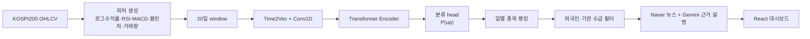

# KOSPI AI Trading Desk

KOSPI200 종목의 **익일 상승확률 P(up)** 을 Transformer로 예측해 랭킹하고, 수급·뉴스 근거를 붙여 대시보드로 보여주는 졸업작품입니다.

> 동아대학교 컴퓨터공학과 졸업작품 4인 팀 프로젝트입니다. 이 저장소는 강승주의 담당 파트인 **정량 모델, 백테스트, out-of-sample 검증**을 중심으로 정리한 포크입니다. 투자 조언이 아니라 금융 시계열 모델 검증 실험입니다.

## 화면

| 대시보드 | AI 후보 랭킹 |
|---|---|
|  |  |

| 종목 근거 리포트 | 백테스트 |
|---|---|
|  |  |

## 기술 선택 이유

| 기술 | 이유 |
|---|---|
| PyTorch Transformer Encoder | 20일 시계열 window 안의 여러 시점 관계를 attention으로 학습 |
| Time2Vec | Transformer 입력에 시간 위치/주기 정보를 추가 |
| Conv1D projection | 가까운 일자 간 로컬 패턴을 먼저 추출하고 `d_model` 차원으로 투영 |
| Classification head | 정확한 수익률보다 "오를 확률"과 랭킹이 목표에 더 적합 |
| 종목 기준 split | 같은 종목 패턴이 train/test에 같이 들어가는 누수 가능성 완화 |
| Gemini + Naver 뉴스 | 모델 점수를 투자 판단처럼 포장하지 않고, 뉴스 근거 설명 레이어로 사용 |
| React + Vite | 후보 비교, 차트, 종목 상세 리포트를 빠르게 구현 |

## 문제와 해결

| 문제 | 적용한 방식 | 결과 |
|---|---|---|
| 주가 예측 모델은 데이터 누수로 성능이 부풀려지기 쉬움 | 종목 기준 train/validation/test 분리 | 학습에 쓰지 않은 test 50종목으로만 성능 측정 |
| 익일 수익률 자체는 노이즈가 큼 | 수익률 회귀보다 상승확률 분류 `P(up)` 채택 | 매일 Top-K 랭킹 문제로 단순화 |
| 예측 점수만으로는 설명이 부족함 | 수급 데이터 + 뉴스 LLM 요약 결합 | 후보 종목별 선정 근거를 대시보드에 표시 |
| 백테스트 숫자가 과장되기 쉬움 | 동일 조건 시장 기준선과 거래비용 0.25% 반영 | 전략과 기준선을 같은 매매 조건으로 비교 |

## 아키텍처



핵심 코드는 `model.py`, `data.py`, `predict.py`, `verify_results.py`, `integrated_pipeline.py`에 있습니다.

## 검증 결과

측정 조건: `2025.06.02 ~ 2026.05.28`, test 50종목, Top-5 동일가중, 일별 리밸런싱, 왕복 거래비용 0.25%.

| 지표 | 값 | 의미 |
|---|---:|---|
| 방향 예측 정확도(DA) | 56.3% | `P(up) > 0.5` 기준 익일 방향 적중률 |
| Rank IC / ICIR | 0.075 / 0.411 | 예측 랭킹과 실제 익일수익 랭킹의 일별 Spearman 상관 |
| Top-5 전략 누적수익(net) | +78.1% | 거래비용 차감 후 누적수익 |
| 동일 50종목 EW 기준선(net) | -9.6% | 같은 매매 조건에서 종목 선택 능력을 보기 위한 기준선 |

재현:

```bash
pip install -r requirements.txt
python verify_results.py
python verify_results.py --plot
```

## 솔직한 한계

| 한계 | 다음 개선 |
|---|---|
| 최근 12개월 구간 성과에 민감 | walk-forward 검증과 더 긴 기간의 안정성 평가 |
| 일별 리밸런싱은 거래비용에 취약 | 리밸런싱 주기 완화, turnover 제약 추가 |
| KIS 수급 데이터는 최근 구간 제약이 큼 | 장기 수급 데이터 확보 후 장기 백테스트 반영 |
| 실제 체결·슬리피지·유동성 미반영 | 실거래 가정에 가까운 비용/체결 모델 추가 |
| 투자 서비스가 아닌 학술 프로젝트 | 리스크 관리, 모니터링, 모델 드리프트 감지 필요 |

## 실행

핵심 결과 재현:

```bash
pip install -r requirements.txt
python verify_results.py
```

전체 후보 분석 파이프라인은 KIS, Naver, Gemini API 키가 필요합니다.

```bash
# .env에 KIS/Naver/Gemini API 키를 직접 설정
python integrated_pipeline.py
python integrated_pipeline.py --run-news
```

프론트엔드:

```bash
cd FE
npm install
npm run dev
```

## 구조

```text
model.py / data.py             Transformer 모델과 누수 방지 피처 생성
predict.py                     체크포인트 추론
verify_results.py              test 50종목 핵심 결과 재현
integrated_pipeline.py         후보 수집, 예측, 수급 결합
stock_news_llm_sentiment.py    뉴스 수집과 LLM 근거 설명
FE/                            React + Vite 대시보드
```
