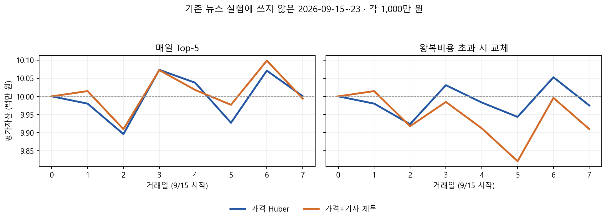

# 뉴스 결합 알고리즘 반복 실험

기존 Huber Ensemble의 다음 거래일 시가→종가 예측을 기준으로, 가격과 뉴스를 결합하는 방식을 비교했습니다. 뉴스 사건 감정·유형을 넣은 선형 회귀, 비선형 트리, 확정되지 않은 계약 등을 제외하는 의미 필터, 기사 제목의 글자 패턴을 직접 학습하는 회귀를 시험했습니다. 모델 학습에는 언제나 예측일 **이전** 날짜의 실제 수익률만 사용했습니다.

앞선 30거래일은 이미 살펴본 기간입니다. 첫 10일로 학습을 시작해, 이후 20일은 하루씩 순서대로 예측했습니다. 아래 자산은 각 10거래일 구간에 1,000만 원을 배정하고, 매일 상위 5종목을 선택하며, 편도 0.125% 거래비용을 적용한 결과입니다.

| 구간 | 모델 | 평균 일별 Rank IC | 최종 자산 |
|---|---|---:|---:|
| 하락 6/30~7/13 | Huber 가격 | 0.1587 | 10,146,168원 |
| 하락 6/30~7/13 | 가격+기사 사건 선형 | 0.1476 | 9,764,482원 |
| 하락 6/30~7/13 | 가격+기사 사건 트리 | 0.0837 | 9,472,984원 |
| 하락 6/30~7/13 | 가격+기사 제목 선형 | 0.1584 | 9,731,845원 |
| 상승 7/29~8/11 | Huber 가격 | -0.0015 | 11,947,329원 |
| 상승 7/29~8/11 | 가격+기사 사건 선형 | -0.0184 | 11,832,849원 |
| 상승 7/29~8/11 | 가격+기사 사건 트리 | -0.0467 | 10,028,734원 |
| 상승 7/29~8/11 | 가격+기사 제목 선형 | -0.0017 | 11,561,450원 |

앞선 기간에서 정한 **강하게 정규화한 제목 모델**을 별도 날짜인 2026-09-15~23의 7거래일에 한 번 적용했습니다. 기존 가격 예측을 다시 계산한 값은 이전 구간의 예측과 최대 0.000000008 정도만 차이 났습니다. 제목 모델의 점수를 저장한 후에 실현 가격으로 평가했습니다.

| 전략 | 평균 일별 Rank IC | 매일 Top-5 최종 자산 | 왕복 거래비용 초과 시 교체 |
|---|---:|---:|---:|
| Huber 가격 | 0.016194 | 10,000,450원 | 9,974,898원 |
| 가격+기사 제목 | 0.016199 | 9,994,011원 | 9,909,633원 |

의미 필터는 확정되지 않은 계약과 스포츠 구단 관련 기사 13건을 제외했지만 사건 모델의 Rank IC를 개선하지 못했습니다. 기사 대상·확정 여부를 구조적으로 재분류하는 소량의 API 감사는 첫 요청이 HTTP 429로 거절되어 즉시 중단했습니다. 정상 분류 결과는 생성되지 않았습니다.

9월 기사 검색 412건 중 247건이 검색 결과 상한에 닿았고, 과거 기사를 사후 검색한 것이므로 거래 당시 제공됐던 기사 집합과 원문을 입증하지 못합니다. 7거래일은 매우 짧으며, 앞선 30일은 여러 알고리즘을 시험하는 데 사용했습니다. **뉴스 결합의 예측 성능 개선은 현재 확인되지 않았습니다.** 추후에는 거래 전에 실제 수집·저장한 기사 자료를 쌓고, 기사 대상·확정 여부의 추출 정확도를 따로 검증한 뒤 새 기간에서 다시 비교해야 합니다.

재현 스크립트: `run_news_walkforward.py`, `run_news_semantic_sensitivity.py`, `run_news_text_walkforward.py`, `run_news_title_holdout.py`. 기사 분류기 실험: `news_fusion/event_v3.py`, `run_event_audit_v3.py`. API 키는 로컬의 무시된 환경 파일에서만 읽습니다.
