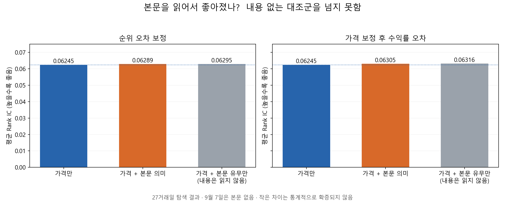

# 뉴스 추가 예측력 연구: 2026-09-26 결과

**결론: 이번에 시험한 방법 중 가격 단독보다 일관되게 예측을 잘하고, 그 개선이 기사 내용 때문이라고 확인된 방법은 없습니다. 서비스의 Huber Ensemble은 변경하지 않았습니다.**

## 실제 수행한 작업

- EMNLP 2024 Newsflow 수익률 학습, ACL 2024 EFSA, ACL 2022 GAME, 공개 E5 표현 모델 및 2025 FinMultiTime 자료를 조사했습니다. [논문별 근거와 적용 범위](news_research_design.md).
- 가격 후보 밖을 포함해 KOSPI200의 기존 검색 제목을 활용했습니다. 제목/본문의 글자 패턴, 제목/본문의 의미 표현, 제목 의미×가격 상태를 비교했습니다.
- 가격 순위 오차를 학습하는 방법과, 가격 예측을 과거 데이터로 보정한 뒤 남은 수익률 오차를 학습하는 방법을 모두 실행했습니다.
- 고정 뉴스 비중과 과거 5개 관측일 검증으로 고른 비중을 비교했습니다. 방법까지 과거 검증으로 선택하는 전략도 별도 실행했습니다.
- 기사 내용 대신 기사 확보 여부만 입력하는 대조군, 날짜 블록 재표집, 뉴스 배치 섞기 진단, 현재/미래 결과를 제거하는 누수 테스트를 추가했습니다.
- 추가 유료 API 호출은 0회입니다. E5는 117,653,760개 파라미터를 모두 고정했고, 작은 회귀 계층만 우리 데이터로 학습했습니다. 금융 전용 언어모델이나 원 논문의 재현이라고 부르지 않습니다.

## 기사 내용의 추가 효과

| 학습 방식 | 가격 단독 IC | 본문 의미 추가 IC | 본문 유무만 추가 IC |
|---|---:|---:|---:|
| 순위 오차 보정 | 0.06245 | 0.06289 | 0.06295 |
| 가격 보정 후 수익률 오차 | 0.06245 | 0.06305 | 0.06316 |

본문을 사용한 작은 개선보다, 본문이 있는 종목인지 여부만으로 생긴 개선이 더 컸습니다. 본문을 이해해서 예측이 좋아졌다는 해석을 지지하지 않습니다.

| 학습 방식 | 방법 | 내용 없는 대조군 대비 IC 차이 | 95% 탐색 구간 |
|---|---|---:|---:|
| 순위 오차 보정 | body_e5_fixed | -0.000054 | [-0.000268, +0.000171] |
| 순위 오차 보정 | body_tfidf_fixed | -0.000018 | [-0.000478, +0.000420] |
| 가격 보정 후 수익률 오차 | body_e5_fixed | -0.000110 | [-0.000783, +0.000491] |
| 가격 보정 후 수익률 오차 | body_tfidf_fixed | -0.001271 | [-0.002224, -0.000272] |

## 1,000만 원 투자 비교

아래는 각 날짜 이전 자료로 뉴스 방법·비중을 고른 결과입니다. 평가 구간에서 가장 돈을 번 조합을 사후 선택한 표가 아닙니다. Top-5 보유·교체, 편도0.125% 비용, 구간별 자금 초기화를 동일 적용했습니다.

| 구간 | 가격 단독 | 순위 오차 뉴스 자동 선택 | 수익률 오차 뉴스 자동 선택 |
|---|---:|---:|---:|
| 6/30~7/13 (10일) | 10,146,168원 | 9,774,270원 | 9,161,583원 |
| 7/29~8/11 (10일) | 11,947,329원 | 10,418,148원 | 11,324,601원 |
| 9/15~9/23 (7일) | 10,000,450원 | 9,868,692원 | 10,078,260원 |

짧은 내부 검증의 승자를 자주 바꾸는 방식은 안정적인 개선을 만들지 못했습니다. 어떤 고정 조합은 특정 구간에서 더 벌었지만 다른 구간에서 손해를 봤고, 전체 순위 예측력 개선도 확인되지 않았습니다.

## 실험 중 발견한 데이터 문제와 수정

최초 v2는 여러 날짜에서 확보한 본문을 합친 뒤 발표일로만 필터링했습니다. 그러면 미래 날짜의 가격 후보에 들어 확보된 본문이 과거 날짜에도 존재하는 것처럼 쓰일 수 있습니다. 원래 해당 날짜의 수집 계획 밖인 본문 사용 478건(346종목·일)을 확인했습니다. 전부 미래에서 온 기사라는 뜻은 아니지만, 이후 후보 선택에 따른 확보 편향을 배제할 수 없어 v2 결과를 채택 근거에서 제외했습니다.
수정판 v3는 원래 해당 날짜·종목의 수집 계획에 있는 본문만 허용하고 1,378개 본문 사용 기록을 대조했습니다. 그 뒤 큰 본문 개선이 사라졌습니다. 위 표와 결론은 수정판과 수정 자료를 이용한 후속 실험만 사용합니다.

## 다음 실험의 우선순위

1. **연속적인 뉴스 학습 자료 확보**: 현재는 37개 날짜 중 앞 10일로 학습을 시작하고 27일을 예측합니다. 표본은 7,392종목·일이지만 시장 상황 표본은 37일뿐입니다. 수개월 이상의 가격·뉴스 공동 학습 자료를 확보한 뒤 모델 규모를 늘리는 것이 우선입니다.
2. **가격 후보에 의존하지 않는 본문 표본**: 종목을 가격 상위 후보로 먼저 고른 뒤 확보한 본문은 본문 존재 자체가 가격 정보를 포함합니다. 기업별 고정된 수집 규칙과 거래 전에 저장한 기사 버전이 필요합니다.
3. **회사별 사건 사실 추출**: 계약 완료와 입찰, 계열사와 상장사, 직접 피해와 상대 회사의 악재를 구분하는 라벨 품질을 먼저 검사합니다. 새 감정 점수를 추가하는 것만으로는 해결되지 않습니다.
4. **검증 기간 고정**: 지금 본 구간은 모두 개발용 탐색 자료입니다. 선택한 구조를 고정하고 새 기간으로 검증해야 합니다. 현재 결과를 더 튜닝해 독립 test 성능이라고 발표하지 않습니다.

## 전체 수익률 오차 모델 결과

| 구간 | 방법 | Rank IC | 최종 자산 | MDD | 거래비용 |
|---|---|---:|---:|---:|---:|
| down | price_rank | 0.15872 | 10,146,168 | -3.91% | 77,441 |
| down | title_tfidf_fixed | 0.14419 | 9,722,653 | -4.79% | 116,194 |
| down | title_tfidf_adaptive | 0.11134 | 9,282,854 | -7.17% | 120,229 |
| down | body_tfidf_fixed | 0.15876 | 9,453,879 | -5.46% | 77,315 |
| down | body_tfidf_adaptive | 0.14572 | 9,715,943 | -3.82% | 102,946 |
| down | title_e5_fixed | 0.15782 | 10,145,452 | -2.38% | 95,811 |
| down | title_e5_adaptive | 0.12568 | 9,443,265 | -5.57% | 126,989 |
| down | body_e5_fixed | 0.16075 | 9,996,681 | -4.91% | 81,787 |
| down | body_e5_adaptive | 0.14375 | 9,409,424 | -5.91% | 140,370 |
| down | title_e5_context_fixed | 0.15758 | 10,213,308 | -2.38% | 91,171 |
| down | title_e5_context_adaptive | 0.13471 | 9,468,781 | -5.31% | 108,010 |
| down | body_presence_fixed | 0.16097 | 10,146,168 | -3.91% | 77,441 |
| down | body_presence_adaptive | 0.15103 | 10,355,824 | -3.93% | 103,828 |
| down | body_presence_context_fixed | 0.16007 | 10,214,565 | -3.98% | 77,870 |
| down | body_presence_context_adaptive | 0.14471 | 10,264,329 | -3.95% | 123,880 |
| down | selected_news | 0.11179 | 9,161,583 | -8.38% | 143,224 |
| up | price_rank | -0.00145 | 11,947,329 | -3.01% | 80,974 |
| up | title_tfidf_fixed | -0.00354 | 11,764,960 | -2.09% | 128,836 |
| up | title_tfidf_adaptive | -0.02739 | 11,569,688 | -3.01% | 124,346 |
| up | body_tfidf_fixed | -0.00300 | 11,543,319 | -3.29% | 109,237 |
| up | body_tfidf_adaptive | -0.00041 | 11,561,769 | -3.36% | 147,011 |
| up | title_e5_fixed | -0.00072 | 11,962,143 | -2.49% | 104,042 |
| up | title_e5_adaptive | -0.01070 | 11,869,561 | -3.01% | 87,438 |
| up | body_e5_fixed | -0.00186 | 11,828,310 | -3.29% | 81,603 |
| up | body_e5_adaptive | -0.00327 | 11,393,031 | -2.57% | 154,976 |
| up | title_e5_context_fixed | -0.00001 | 12,276,810 | -2.49% | 83,601 |
| up | title_e5_context_adaptive | -0.04962 | 10,999,462 | -3.01% | 144,634 |
| up | body_presence_fixed | -0.00178 | 12,022,896 | -2.45% | 86,438 |
| up | body_presence_adaptive | 0.00059 | 11,580,560 | -2.89% | 116,695 |
| up | body_presence_context_fixed | -0.00184 | 12,022,896 | -2.45% | 86,438 |
| up | body_presence_context_adaptive | -0.00035 | 11,580,560 | -2.89% | 116,695 |
| up | selected_news | -0.05502 | 11,324,601 | -2.38% | 209,680 |
| sep | price_rank | 0.01619 | 10,000,450 | -1.45% | 55,162 |
| sep | title_tfidf_fixed | 0.00351 | 9,812,210 | -1.95% | 83,518 |
| sep | title_tfidf_adaptive | 0.00481 | 10,107,105 | -1.74% | 140,722 |
| sep | body_tfidf_fixed | 0.01619 | 10,000,450 | -1.45% | 55,162 |
| sep | body_tfidf_adaptive | 0.01619 | 10,000,450 | -1.45% | 55,162 |
| sep | title_e5_fixed | 0.01256 | 9,749,228 | -2.95% | 68,318 |
| sep | title_e5_adaptive | -0.01060 | 9,904,148 | -1.11% | 154,584 |
| sep | body_e5_fixed | 0.01619 | 10,000,450 | -1.45% | 55,162 |
| sep | body_e5_adaptive | 0.01619 | 10,000,450 | -1.45% | 55,162 |
| sep | title_e5_context_fixed | 0.01171 | 9,781,271 | -2.82% | 58,583 |
| sep | title_e5_context_adaptive | -0.01137 | 9,785,723 | -2.16% | 148,600 |
| sep | body_presence_fixed | 0.01619 | 10,000,450 | -1.45% | 55,162 |
| sep | body_presence_adaptive | 0.01619 | 10,000,450 | -1.45% | 55,162 |
| sep | body_presence_context_fixed | 0.01619 | 10,000,450 | -1.45% | 55,162 |
| sep | body_presence_context_adaptive | 0.01619 | 10,000,450 | -1.45% | 55,162 |
| sep | selected_news | -0.00185 | 10,078,260 | -1.74% | 161,181 |

[순위 오차 모델의 모든 결과·구간별 그래프](news_residual_results.md). 수익률 오차 모델은 `run_news_orthogonal.py`, 통합 보고서는 `report_news_research_conclusion.py`로 재현합니다.

공통 한계: 사후 RSS 검색 상한, 과거 본문 버전 불확실성, 시점별 KOSPI200 종목 복원의 한계, 소수 시장 날짜, 반복 탐색에 따른 선택 편향입니다. 기사 본문 의미 표현은 결합 텍스트 앞256토큰, 본문 글자 패턴은 확보한 전문을 사용했습니다. 9월에는 본문이 없어 본문 모델은 가격 단독으로 돌아갑니다.
