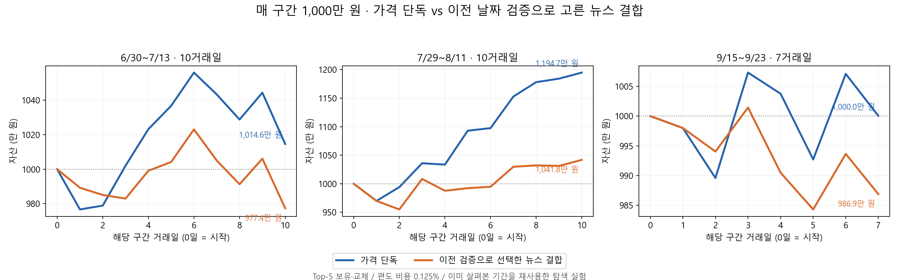
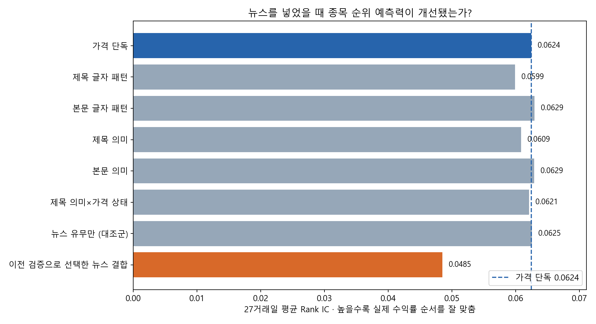

# 뉴스로 가격 모델의 순위 오차를 보정한 실험

**수정판 v3:** 각 날짜의 원래 수집 계획에 포함된 본문만 사용했습니다. v2는 다른 날짜 후보로 확보한 본문까지 풀어서 사용해 본문 존재 여부에 이후 후보 선정 정보가 섞일 여지가 있었습니다. v2의 본문 개선 수치는 채택 근거에서 제외하고 이 수정판으로 대체했습니다.

[연구 근거와 설계](news_research_design.md). 유료 API 추가 호출 0회. 공개 E5는 문장 표현기로 고정하고 순위 보정기만 학습했습니다.

**전체 37일 중 첫 10일은 준비, 나머지 27일은 하루씩 이전 자료로만 학습·예측했습니다. 모두 이미 관찰한 날짜이므로 독립 최종 test는 아닙니다.**

## 핵심 비교

아래 뉴스 결합은 수익률을 본 뒤 고른 승자가 아닙니다. 매 예측일 전에 과거 검증 Rank IC로 방법·계수·비중을 선택했고, 개선이 없으면 가격 단독을 사용합니다.

| 기간 | 가격 단독 자산 | 검증 선택 뉴스 자산 | 뉴스 결합 차이 | 가격 IC | 뉴스 IC |
|---|---:|---:|---:|---:|---:|
| 6/30~7/13 · 10거래일 | 10,146,168원 | 9,774,270원 | -371,898원 | 0.1587 | 0.1541 |
| 7/29~8/11 · 10거래일 | 11,947,329원 | 10,418,148원 | -1,529,180원 | -0.0015 | -0.0157 |
| 9/15~9/23 · 7거래일 | 10,000,450원 | 9,868,692원 | -131,759원 | 0.0162 | -0.0107 |

## 모든 방법 공개

fixed는 정규화 계수10·뉴스 비중0.25, adaptive는 이전 5개 관측일 검증으로 결정합니다. 순위 점수를 상승확률로 해석하지 않으므로 방향정확도 대신 Top-5 실제 상승 비율을 표기합니다.

| 기간 | 방법 | Rank IC | 최종 자산 | MDD | 비용 | Top-5 상승 비율 |
|---|---|---:|---:|---:|---:|---:|
| down | price_rank | 0.1587 | 10,146,168 | -3.91% | 77,441 | 42.0% |
| down | title_tfidf_fixed | 0.1542 | 9,716,975 | -3.43% | 93,275 | 42.0% |
| down | title_tfidf_adaptive | 0.1456 | 9,523,296 | -4.77% | 128,416 | 42.0% |
| down | body_tfidf_fixed | 0.1605 | 10,079,023 | -4.00% | 88,026 | 42.0% |
| down | body_tfidf_adaptive | 0.1568 | 10,323,330 | -3.90% | 108,979 | 40.0% |
| down | title_e5_fixed | 0.1551 | 10,143,732 | -4.03% | 92,562 | 44.0% |
| down | title_e5_adaptive | 0.1587 | 10,146,168 | -3.91% | 77,441 | 42.0% |
| down | body_e5_fixed | 0.1609 | 10,083,517 | -4.03% | 77,329 | 42.0% |
| down | body_e5_adaptive | 0.1560 | 10,624,103 | -4.92% | 181,140 | 44.0% |
| down | title_e5_context_fixed | 0.1593 | 10,234,992 | -2.14% | 103,015 | 42.0% |
| down | title_e5_context_adaptive | 0.1234 | 9,817,992 | -4.46% | 165,101 | 42.0% |
| down | coverage_fixed | 0.1599 | 10,431,528 | -2.91% | 105,407 | 46.0% |
| down | coverage_adaptive | 0.1507 | 9,876,948 | -3.90% | 140,034 | 40.0% |
| down | body_presence_fixed | 0.1611 | 10,186,544 | -3.92% | 82,988 | 44.0% |
| down | body_presence_adaptive | 0.1536 | 10,335,379 | -3.90% | 143,408 | 40.0% |
| down | body_presence_context_fixed | 0.1609 | 10,939,840 | -2.68% | 145,425 | 42.0% |
| down | body_presence_context_adaptive | 0.1535 | 10,880,823 | -3.90% | 165,395 | 46.0% |
| down | selected_news | 0.1541 | 9,774,270 | -4.46% | 160,898 | 44.0% |
| up | price_rank | -0.0015 | 11,947,329 | -3.01% | 80,974 | 70.0% |
| up | title_tfidf_fixed | -0.0021 | 11,709,552 | -3.01% | 91,438 | 68.0% |
| up | title_tfidf_adaptive | -0.0121 | 11,444,673 | -3.01% | 152,437 | 72.0% |
| up | body_tfidf_fixed | -0.0020 | 11,562,856 | -1.72% | 117,964 | 66.0% |
| up | body_tfidf_adaptive | -0.0048 | 10,848,937 | -4.50% | 144,989 | 64.0% |
| up | title_e5_fixed | -0.0023 | 11,725,864 | -3.01% | 104,593 | 70.0% |
| up | title_e5_adaptive | -0.0143 | 11,637,043 | -3.01% | 115,364 | 70.0% |
| up | body_e5_fixed | -0.0024 | 11,026,246 | -2.45% | 100,118 | 62.0% |
| up | body_e5_adaptive | -0.0051 | 10,848,937 | -4.50% | 144,989 | 64.0% |
| up | title_e5_context_fixed | -0.0039 | 11,265,035 | -1.78% | 106,897 | 66.0% |
| up | title_e5_context_adaptive | -0.0015 | 11,947,329 | -3.01% | 80,974 | 70.0% |
| up | coverage_fixed | -0.0038 | 10,992,344 | -2.63% | 114,579 | 66.0% |
| up | coverage_adaptive | -0.0034 | 11,370,158 | -5.37% | 127,366 | 62.0% |
| up | body_presence_fixed | -0.0025 | 10,954,775 | -2.63% | 108,278 | 62.0% |
| up | body_presence_adaptive | -0.0057 | 10,848,937 | -4.50% | 144,989 | 64.0% |
| up | body_presence_context_fixed | -0.0030 | 10,816,400 | -2.47% | 178,586 | 58.0% |
| up | body_presence_context_adaptive | -0.0043 | 11,274,707 | -4.50% | 141,349 | 64.0% |
| up | selected_news | -0.0157 | 10,418,148 | -4.50% | 190,032 | 66.0% |
| sep | price_rank | 0.0162 | 10,000,450 | -1.45% | 55,162 | 31.4% |
| sep | title_tfidf_fixed | 0.0138 | 9,932,645 | -1.09% | 50,137 | 31.4% |
| sep | title_tfidf_adaptive | 0.0112 | 9,717,362 | -2.97% | 124,227 | 28.6% |
| sep | body_tfidf_fixed | 0.0162 | 10,000,450 | -1.45% | 55,162 | 31.4% |
| sep | body_tfidf_adaptive | 0.0162 | 10,000,450 | -1.45% | 55,162 | 31.4% |
| sep | title_e5_fixed | 0.0164 | 10,139,892 | -1.76% | 81,070 | 37.1% |
| sep | title_e5_adaptive | 0.0022 | 9,967,112 | -1.49% | 99,974 | 31.4% |
| sep | body_e5_fixed | 0.0162 | 10,000,450 | -1.45% | 55,162 | 31.4% |
| sep | body_e5_adaptive | 0.0162 | 10,000,450 | -1.45% | 55,162 | 31.4% |
| sep | title_e5_context_fixed | 0.0176 | 10,121,942 | -1.24% | 86,237 | 42.9% |
| sep | title_e5_context_adaptive | -0.0241 | 9,951,976 | -1.52% | 110,441 | 37.1% |
| sep | coverage_fixed | 0.0182 | 10,121,942 | -1.24% | 86,237 | 42.9% |
| sep | coverage_adaptive | 0.0162 | 10,000,450 | -1.45% | 55,162 | 31.4% |
| sep | body_presence_fixed | 0.0162 | 10,000,450 | -1.45% | 55,162 | 31.4% |
| sep | body_presence_adaptive | 0.0162 | 10,000,450 | -1.45% | 55,162 | 31.4% |
| sep | body_presence_context_fixed | 0.0162 | 10,000,450 | -1.45% | 55,162 | 31.4% |
| sep | body_presence_context_adaptive | 0.0162 | 10,000,450 | -1.45% | 55,162 | 31.4% |
| sep | selected_news | -0.0107 | 9,868,692 | -1.71% | 123,900 | 31.4% |

## 불확실성·대조 실험

| 방법 | 평균 IC 개선 | 일자 블록 재표집 95% 구간 | 실제 뉴스 배치 IC | 뉴스 보정치 섞기 평균 IC |
|---|---:|---:|---:|---:|
| title_tfidf_fixed | -0.00256 | [-0.00601, +0.00102] | 0.05989 | 0.06200 |
| title_tfidf_adaptive | -0.01012 | [-0.02471, +0.00340] | 0.05233 | 0.05644 |
| body_tfidf_fixed | +0.00048 | [-0.00065, +0.00172] | 0.06293 | 0.06202 |
| body_tfidf_adaptive | -0.00197 | [-0.00415, +0.00000] | 0.06048 | 0.06247 |
| title_e5_fixed | -0.00158 | [-0.00335, +0.00036] | 0.06086 | 0.06229 |
| title_e5_adaptive | -0.00838 | [-0.01800, +0.00022] | 0.05407 | 0.05921 |
| body_e5_fixed | +0.00044 | [-0.00086, +0.00191] | 0.06289 | 0.06198 |
| body_e5_adaptive | -0.00237 | [-0.00807, +0.00328] | 0.06007 | 0.06135 |
| title_e5_context_fixed | -0.00034 | [-0.00165, +0.00090] | 0.06211 | 0.06150 |
| title_e5_context_adaptive | -0.02352 | [-0.05158, -0.00123] | 0.03893 | 0.03277 |
| coverage_fixed | +0.00008 | [-0.00109, +0.00118] | 0.06252 | 0.06150 |
| coverage_adaptive | -0.00368 | [-0.00777, +0.00000] | 0.05876 | 0.05124 |
| body_presence_fixed | +0.00050 | [-0.00080, +0.00198] | 0.06295 | 0.06208 |
| body_presence_adaptive | -0.00348 | [-0.00715, -0.00017] | 0.05897 | 0.06194 |
| body_presence_context_fixed | +0.00022 | [-0.00117, +0.00156] | 0.06267 | 0.06194 |
| body_presence_context_adaptive | -0.00301 | [-0.00744, +0.00070] | 0.05944 | 0.06207 |
| selected_news | -0.01396 | [-0.03159, +0.00315] | 0.04849 | 0.04771 |

3거래일 블록을 구간 내부에서 재표집했습니다. 뉴스 보정치는 같은 날 비슷한 가격 순위의 종목끼리 섞었습니다. 이 대조군은 예측 시점의 배치 효과 진단이며 전체 학습·선택을 다시 수행하는 유의성 검정이 아닙니다. 여러 방법을 반복 탐색한 영향을 보정하지 않았으므로 통계적 확증으로 해석할 수 없습니다.

## 데이터와 실행 기록

- 전체 7,392종목·일 중 제목이 있는 행 6,883, 본문이 있는 행 802.
- 9월에는 본문이 없어 본문 단독 보정은 0입니다. 9월에서 본문 방법이 가격 단독과 같은 결과인 것은 검증 성공이 아닙니다.
- 본문 TF-IDF는 확보한 전문, E5는 결합 텍스트의 앞 256토큰을 사용했습니다. 긴 본문의 모든 내용을 의미 분석했다는 주장은 하지 않습니다.
- 검증 선택 횟수: {"title_tfidf_adaptive": 9, "price_rank": 8, "body_e5_adaptive": 5, "title_e5_context_adaptive": 4, "title_e5_adaptive": 1}.
- Google News RSS 사후 검색이고 결과 상한과 과거 본문 버전 불확실성이 있습니다. 기존 KOSPI200 종목 집합의 생존편향 가능성도 남습니다.
- 최종 자산에는 기존 보유 종목의 야간 수익도 포함됩니다. Open→Close Rank IC와 자산 순위가 다른 것은 모순이 아닙니다.
- 실행: `run_news_residual_corrected.py prepare`, `embeddings`, `fit`, `evaluate`, `report` 순서. 초기 제목 특징·임베딩은 `run_news_residual_research.py` 산출물을 재사용합니다.
- 원자료 해시·고정 언어모델 revision·선택 이력·예측 점수·원장 검증 결과: `outputs/news_residual_corrected_v3`.
- 학습 종료일 < 예측일을 강제하고, 현재·미래 실현값을 제거해도 예측이 같은지 자동 테스트했습니다. 서비스 기본 모델은 변경하지 않았습니다.
