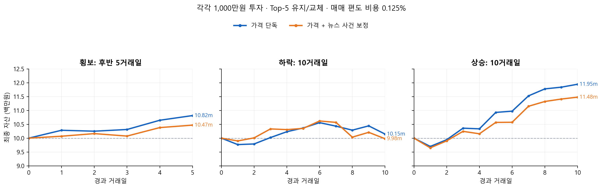

# KOSPI 200 regime experiment reproduction

This folder records the fixed dates and published **model-derived** numeric tables for the exploratory sideways/down/up news experiment. It deliberately contains no market-price files, realized per-stock returns, article text, headlines, URLs, or API credentials.

## Published files

| File | Contents |
|---|---|
| [`published/numeric_features.csv.gz`](published/numeric_features.csv.gz) | 5,992 stock-session rows: fixed Huber forecasts, price rank, 14 numeric event types, and event presence |
| [`published/model_scores.csv.gz`](published/model_scores.csv.gz) | 4,992 scored stock-session rows after the first five warmup days: price, presence-only control, fixed event correction, validation-gated correction |
| [`published/metrics.csv`](published/metrics.csv) | Aggregate Rank IC, direction accuracy, Top-5 capital, MDD, Sharpe, fees and turnover for each strategy/regime |
| [`published/daily_equity.csv`](published/daily_equity.csv) | Daily portfolio equity and fee series for the identical replay engine |
| [`published/regime_dates.csv`](published/regime_dates.csv) | Dates and retrospective market regime labels |
| [`published/manifest.json`](published/manifest.json) | Row counts, SHA-256 checksums and exclusions |



For each period, both portfolios start at 10m KRW. The plotted news strategy is the **fixed event correction**, not the deployed validation-gated strategy. The gate selected news on 0 of 25 scored sessions, so deployed ranking remains the Huber price ranking.

## Periods

The experiment used the first selected 10-session block in each realized KOSPI 200 regime:

| Regime | Signal sessions | Sessions | Realized KOSPI 200 return |
|---|---:|---:|---:|
| Sideways | 2026-06-01–2026-06-15 | 10 | +1.30% |
| Down | 2026-06-30–2026-07-13 | 10 | -20.24% |
| Up | 2026-07-29–2026-08-11 | 10 | +4.41% |

These windows were selected retrospectively from non-overlapping 10-session blocks, classifying each block by realized KOSPI 200 return (> +3% up, < -3% down, otherwise sideways). They are exploratory and are not an untouched final test set. Regime selection uses future realized index returns and must not be used as a live trading signal.

## Build a local feature/label table

Teammates can use the committed numeric features directly for feature inspection and strategy ranking comparisons. To calculate prediction labels with an authorized local daily-bar source, join on the next-session date and stock code:

```bash
python -m research.regime_benchmark.join_local_bars \
  --bars PATH_TO_AUTHORIZED_DAILY_BARS.parquet
```

The local bars need `date,ticker,Open,Close` columns. The generated `outputs/regime_benchmark_data/joined_features.csv.gz` is ignored by Git and must stay local. The output has the next-session Open→Close return, but no price bars.

If a teammate has the original local experiment caches, the older exporter below can also build the legacy guarded-news table. Its features and targets are **not identical** to the event-residual published files above.

The exporter reads the experiment's local, ignored caches and writes three compressed CSV files under `outputs/regime_benchmark_data/`. The output has one row per stock and session, with Huber scores, aggregate numeric news fields, and the realized next-session open-to-close return. It strips article text, URLs, publisher names, and article identifiers.

```bash
pip install pandas pyarrow
python research/regime_benchmark/export_local.py \
  --panel outputs/news_guarded_calendar3_v2/scored_panel.parquet \
  --bars ../../outputs/validation_report/inputs/daily_bars.parquet
```

This is a feature/target table for ranking and prediction experiments. It does not include OHLCV and therefore cannot reproduce the exact share-based portfolio replay, order prices, or transaction-cost ledger. To run that replay, use an authorized local OHLCV source and the existing `portfolio_replay.py` engine.

The source caches are not tracked by Git. Each teammate must obtain and keep their own licensed/authorized source data locally. KRX's current website terms prohibit copying or distributing site information without prior permission; the repository is public, so the generated price-derived dataset is intentionally not checked in. The historical article archive is also excluded. See [KRX website terms](https://data.krx.co.kr/contents/MDC/INFO/informationController/MDCINFO003.cmd).

## Interpretation limits

- Only 30 signal sessions (10 per selected regime) are used.
- Regimes and periods were chosen after observing realized market movement.
- Archived publisher article versions were not historically version-verified; the features are retrospective.
- Article search was bounded and is not an exhaustive archive.
- The dataset is suitable for reproducing exploratory ranking analyses, not for claiming robust out-of-sample news alpha.
